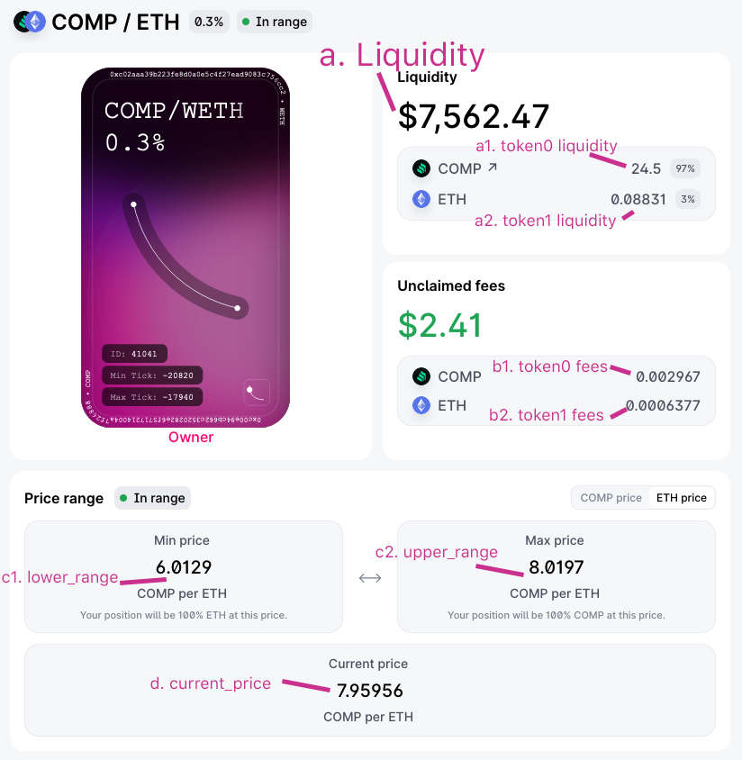

# Uniswap v3

This doc aims to document how to access all values exposed to end users in the Uniswap v3 interface. The assumption is that users are interacting with `web3.py` but this should work for all other related libraries. This document assumes basic understand of ETH contract interaction.

## Relevant links

[Positions](https://github.com/Uniswap/uniswap-v3-sdk/blob/main/src/entities/position.ts) - script used to calculatevalues shown to end users

 

## Main contracts

| Contract name                | Address                                      | ABI                                                          |
| ---------------------------- | -------------------------------------------- | ------------------------------------------------------------ |
| `NonfungiblePositionManager` | `0xC36442b4a4522E871399CD717aBDD847Ab11FE88` | [link](http://api.etherscan.io/api?module=contract&action=getabi&address=0xc36442b4a4522e871399cd717abdd847ab11fe88&format=raw) |
| `UniswapV3Factory`           | `0x1F98431c8aD98523631AE4a59f267346ea31F984` | [link](http://api.etherscan.io/api?module=contract&action=getabi&address=0x1F98431c8aD98523631AE4a59f267346ea31F984&format=raw) |
| `UniswapV3Pool`              | Varies based on pool                         | [link](http://api.etherscan.io/api?module=contract&action=getabi&address=0x8ad599c3a0ff1de082011efddc58f1908eb6e6d8&format=raw) |

Each pool has its own address defined by the token pair and the fee. Finding the address of the pool will involve providing the contract address of the pair along with the fee. The `getPool` function in the `UniswapV3Factory` contract provides this interface.

## Getting positions data

### Enumerate positions

To find the total amount of user positions, use `balanceOf(address)` within the `NonfungiblePositionManager` where `address` is simply the address of the NFT owner.

Once we know the total amount of user owned NFTs (which is the same as the amount of positions), we can get the NFT ID by enumerating with `tokenOfOwnerByIndex(address,index)` (also available in `NonfungiblePositionManager`)with index being a value between 0 and the amount of NFTs owned.

The NFT ID is the same as the one displayed in your uniswap interace.

### Get position data

| What                                      | Functions                                                    | Notes                                                        |
| ----------------------------------------- | ------------------------------------------------------------ | ------------------------------------------------------------ |
| **a.** Liquidity                          | `positions(nft_id)` in `UniswapV3Factory` will return a liquidity value. | **TODO**: Need to figure out how to represent the liquidity as on of the token pairs. |
| **a1, a2.** token liquidity               | **TODO**                                                     |                                                              |
| **b1, b2.** token fees                    | **TODO**: figure out web3.py way of doing static calls. [this part may help](https://github.com/Uniswap/uniswap-interface/blob/6c880d29a64a497c61202a089243aeb2e544af2c/src/hooks/useV3PositionFees.ts#L18). Collected fees can just be calculated by filtering on collect events for the NFT ID. | calling `collect` statically seems to be an option to get these values but there seems to be no `web3.py` way of doing this |
| **c1, c2**. Range                         | This is done by getting the upper and lower tick part of the `positions(nft_id)` call. | **TODO**: convert tick ranges to token value ranges          |
| Token addresses                           | `positions(nft_id)` in `UniswapV3Factory` will return the addresses of `token0` and `token1`. | These addresses are used later to get the pool address.      |
| Position fee                              | `positions(nft_id)` in `UniswapV3Factory` will return the fee. | `10000` is the 1% fee pool, ` 3000` is the .3% fee pool, `500` the .05% pool |
| Pool address                              | `getPool(token0, token1, fee)` in `UniswapV3Factory` will return the address of the `UniswapV3Pool` to interact with. | Pool address is needed to get stats such as relative token prices |
| **d.** Price of token1 in terms of token0 | `slot0()` in `UniswapV3Pool` will return `sqrtPriceX96`. The price of each token is then `price = 1 / ( ( sqrtPriceX96/math.pow(2,96) ) / math.pow(10,6) )**2` | This only seems to work for some pairs, like ETH-USDC. Others such as ETH-DAI will return the correct value but with a wrong decimal place. This price may be outdated so be sure to check other feeds if acting on it. |

